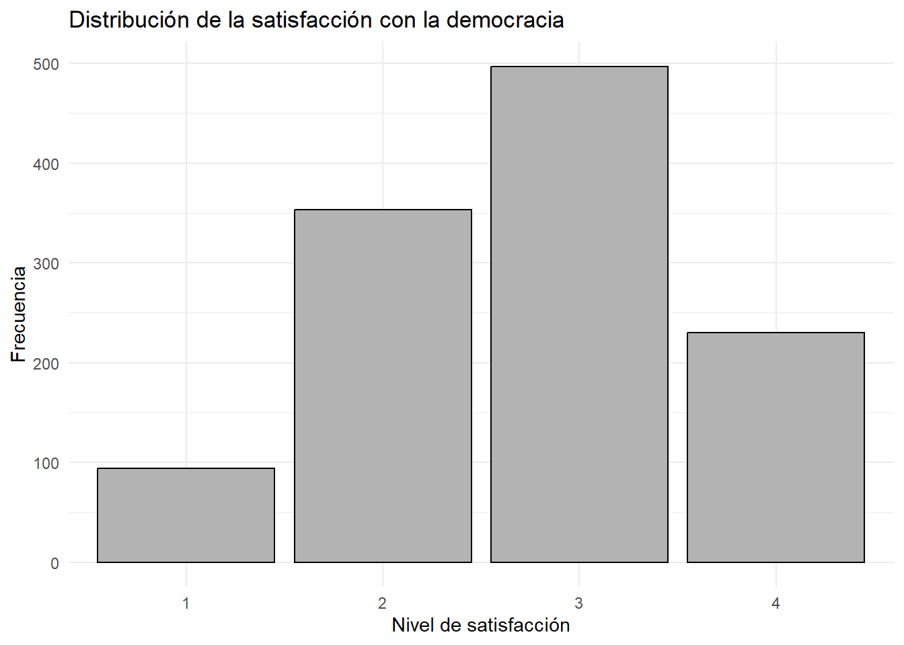
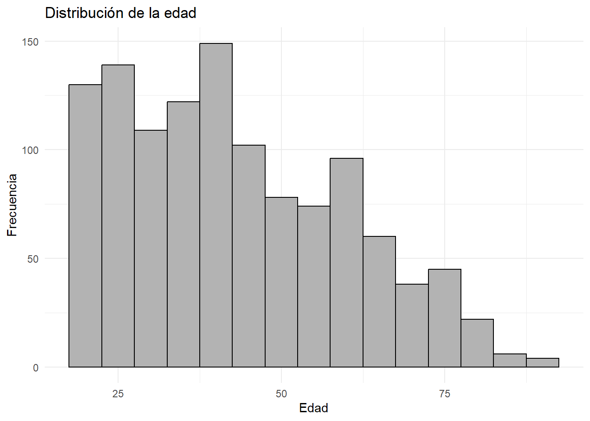
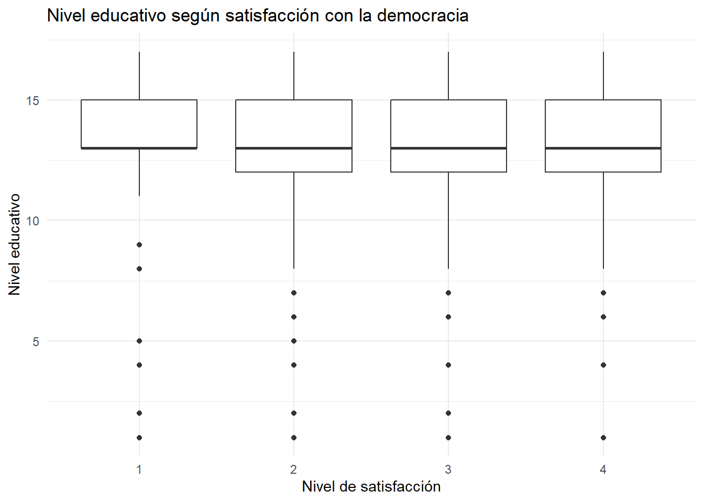
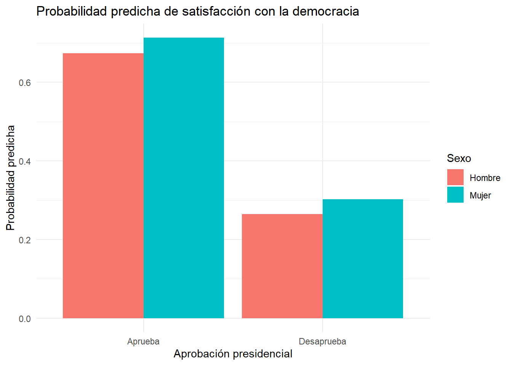

## Introduccion

::::: columns
::: {.column width="50%"}
Contexto:

-   Creciente polarización política en América Latina.
-   Elección de Javier Milei en Argentina (2023).
-   Cuestionamientos a las instituciones democráticas.
:::

::: {.column width="50%"}
Justificación:

-   La satisfacción con la democracia permite evaluar la legitimidad percibida del sistema democrático.
-   Analizar diferencias según edad, sexo y nivel educativo.
-   Uso de datos del Latinobarómetro 2023 para el caso argentino.
:::
:::::

## Pregunta e hipotesis

::::: columns
::: {.column width="60%"}
-   ¿Cómo se distribuye la satisfacción con la democracia según variables sociodemográficas (edad, sexo y nivel educativo) en Argentina (2023)?

-La satisfacción con la democracia se distribuye de manera diferenciada según variables sociodemográficas (edad, sexo y nivel educativo) en Argentina (2023).
:::

::: {.column width="40%"}

:::
:::::
## Descripción de la muestra

::::: columns
::: {.column width="50%"}
### Características generales

-   **N = 1.174** casos válidos
-   **Edad promedio:** 42,9 años
-   **Desv. estándar:** 16,9 años
-   **Rango:** 18 a 90 años
:::

::: {.column width="50%"}
### Composición de la muestra

-   **Mujeres:** 51,8%

-   **Hombres:** 48,2%

-   Nivel educativo promedio: **12,8 puntos**

-   Desv. estándar: **3,2 puntos**
:::
:::::

##  variables

::::: columns
::: {.column width="35%"}
### Variable dependiente

**Satisfacción con la democracia (P11STGBS.A)**

-   Muy satisfecho
-   Más bien satisfecho
-   No muy satisfecho
-   Nada satisfecho
:::

::: {.column width="65%"}
### Variables independientes

**Edad (EDAD)**

-   Variable numérica continua.

**Sexo (SEXO)**

-   Hombre o mujer

**Nivel educativo (S11)** - Sin estudios - Básica - Media - Superior
:::
:::::

## Satisfacción con la democracia

### Hallazgo principal

{width="80%"}

-   El 61,9% de los encuestados se declara **no muy satisfecho** o **nada satisfecho** con la democracia.
-   Solo el 8,0% se encuentra **muy satisfecho**.

## Satisfacción con la democracia según sexo

## Resultado

-   Hombres y mujeres presentan patrones muy similares.
-   La categoría más frecuente en ambos grupos es *"No muy satisfecho"*.
-   No se observan diferencias relevantes entre sexos.

### Prueba Chi-cuadrado

-   χ² = 4,41
-   gl = 3
-   p = 0,221 *Conclusión:* No existe asociación estadísticamente significativa entre sexo y satisfacción con la democracia.

## Satisfacción con la democracia según edad

## Resultado

-   Las distribuciones de edad son similares entre los distintos niveles de satisfacción.
-   No se observan diferencias sustantivas en las medianas de edad.
-   La variabilidad etaria es amplia en todas las categorías.

### Conclusión

La edad no parece constituir un factor relevante para explicar las diferencias en la satisfacción con la democracia en Argentina durante 2023.

## Satisfacción con la democracia según nivel educativo

## Resultado

-   Se observan diferencias en la distribución de la satisfacción con la democracia entre los distintos niveles educativos.
-   La proporción de personas satisfechas e insatisfechas varía según el nivel de estudios alcanzado.
-   Esto sugiere que la educación podría estar asociada a distintas formas de evaluar el funcionamiento de la democracia.

Conclusión:El nivel educativo aparece como una variable relevante para comprender las diferencias en la satisfacción con la democracia entre los encuestados.

## Regresión logística ordinal

### Variables incluidas:

-Sexo,Edad, Nivel educativo

### Resultados

-   Ninguna de las variables presentó efectos estadísticamente significativos.
-   Los coeficientes observados fueron de baja magnitud.
-   Los efectos identificados no permiten explicar de manera sustantiva las diferencias en la satisfacción con la democracia.

## Conclusión

Las variables sociodemográficas analizadas no muestran una capacidad explicativa relevante sobre la satisfacción con la democracia en Argentina durante 2023.

## Regresión logística binaria

### Variable dependiente

-   Satisfecho con la democracia
-   Insatisfecho con la democracia

### Variables predictoras

-   Sexo
-   Edad
-   Nivel educativo
-   Aprobación presidencial

## Resultados

-   La aprobación presidencial fue el predictor más relevante del modelo.
-   Las variables sociodemográficas presentaron efectos débiles o no significativos.
-   La evaluación del gobierno se asocia con la satisfacción respecto al funcionamiento de la democracia.

### Conclusión

La satisfacción con la democracia parece estar más relacionada con factores políticos coyunturales que con características sociodemográficas de los encuestados.

## Regresión logística binaria: Modelo 2

### Variables incluidas

-   Sexo
-   Edad
-   Nivel educativo
-   Aprobación presidencial

## Resultados principales

-   La aprobación presidencial fue la única variable estadísticamente significativa.
-   Quienes desaprueban al presidente presentan menores probabilidades de sentirse satisfechos con la democracia.
-   Sexo, edad y nivel educativo no mostraron efectos significativos.

### Indicadores del modelo

-   AIC = 1347,3
-   OR desaprobación presidencial = 0,173
-   p \< 0,001

## Probabilidades predichas

## Hallazgos

-   Entre quienes aprueban al presidente, la probabilidad de estar satisfecho con la democracia supera el 65%.
-   Entre quienes desaprueban al presidente, la probabilidad desciende a valores cercanos al 30%.
-   Las diferencias entre hombres y mujeres son reducidas.

## Conclusión

La aprobación presidencial constituye el factor más relevante para explicar la satisfacción con la democracia en Argentina durante 2023.

## gracias por su atencion!!

.jpg)
